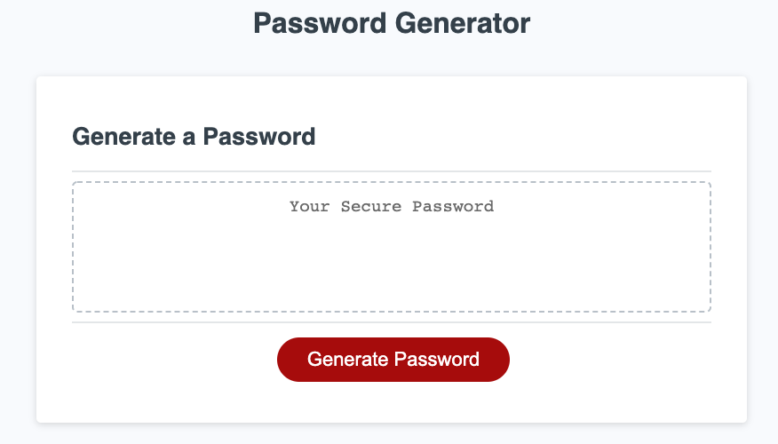
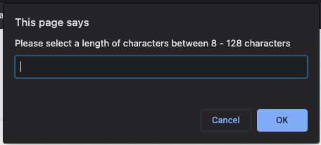
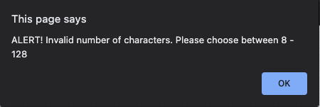
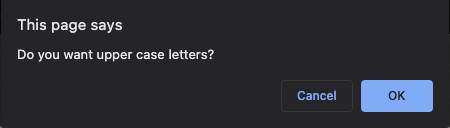
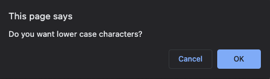
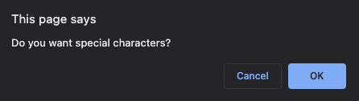
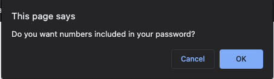
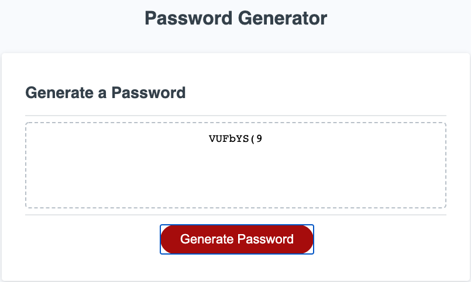

# PasswordGenerator

## Description

https://ssolis86.github.io/PasswordGenerator/ is a web application that generates a random password between 8 - 128 characters  and four characteristics chosen by the user.

Supported Languages

English

## Technology Stack

### Frontend

- HTML 
- CSS

### Backend

- Javascript

# Phase 1

## Division of Labor

* Stephen
    * Established variables for upperCase option, lowerCase option, # of characters, and special characters.
    * Implimented if-statements check through every variable with the user to ask what options meet their needs.
    * Used a for-statement takes the users decisions and uses the Math.random function to generate the random characters for each character within the password.
    
## User Interface

Landing Page

Number of characters prompt

Error page if number of character parameter is not met

Upper case letter prompt

Lower case letter prompt

Special character prompt

Ask the user if they would like numbers in their password

Randomly generated password example (8 character password chosen)

### Testing
Unit and Integration tests 01/21/21

## Challenges
The main challenge of the development of this application was coming up with an efficient solution to take the users input and store it in a variable.  Initially I had far more variables.  I realized the complexity of my original design complicated the implimentation in terms of programming the solution.